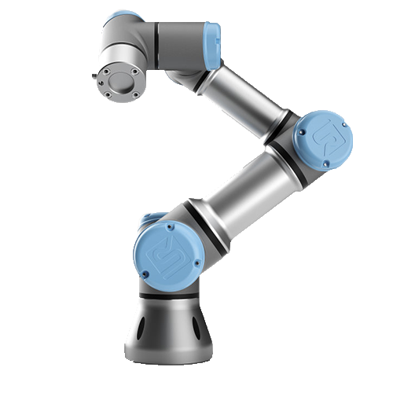
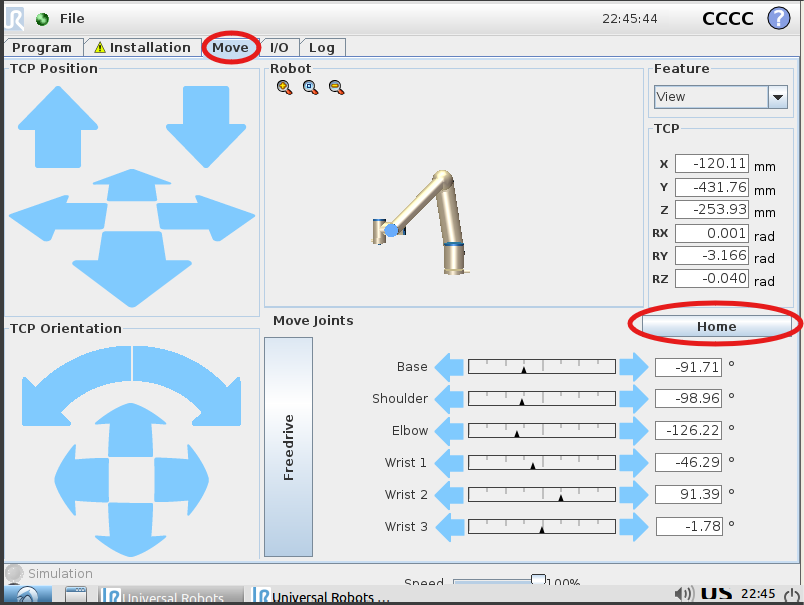
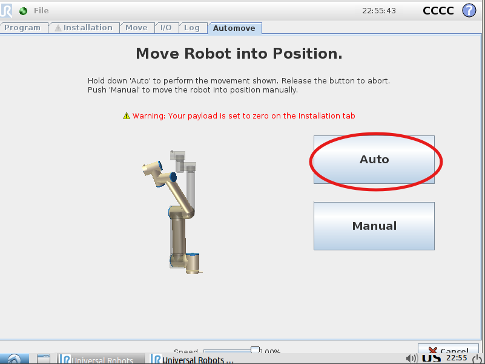
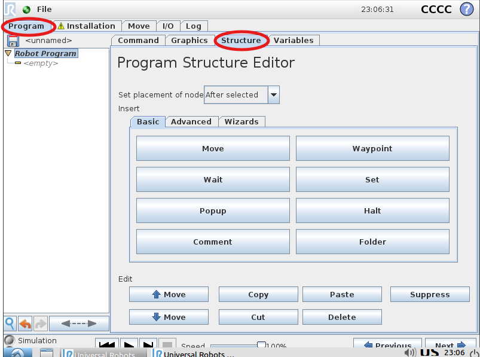
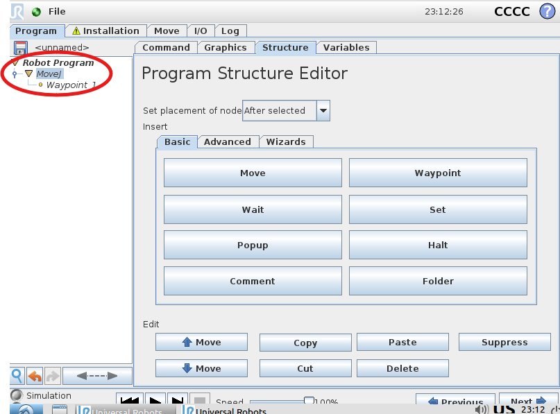
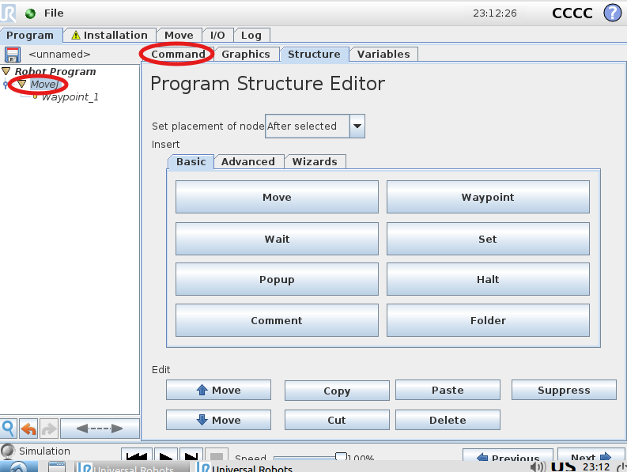
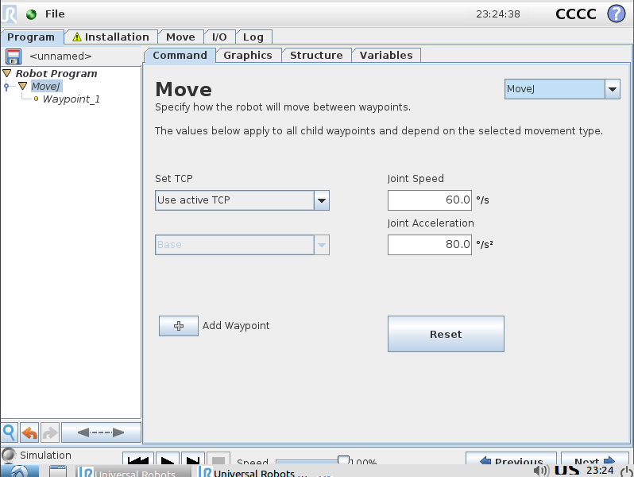
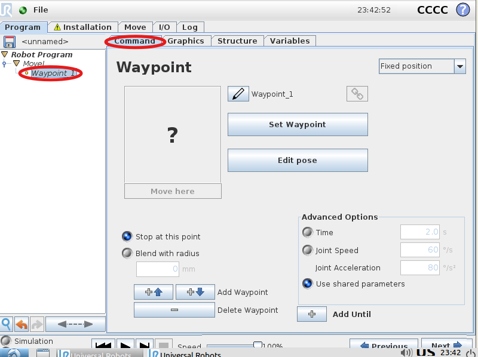
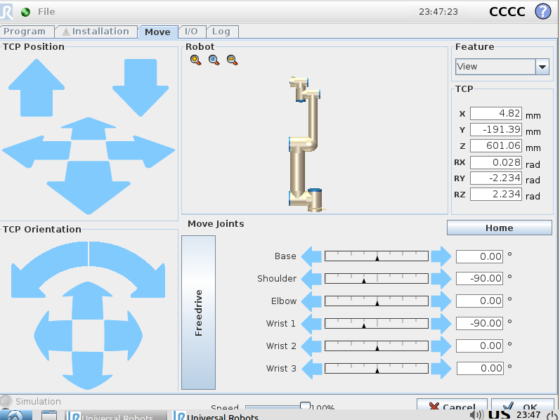
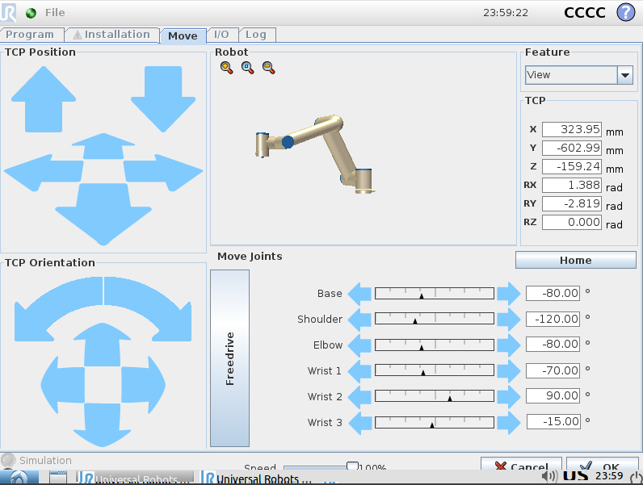

# {Tutorial: Pick and place con URSim}

El siguiente tutorial tiene como objetivo desarrollar "Pick and place" para el brazo róbotico colaborativo "UR5", todo el programa desarrollado a través de la aplicación oficial de Universal Robots "URSim" mismo programa el cual podrá ser utilizado en el robot físico.

Así pues, a lo largo de este tutorial estudiaremos los distintos tipos de movimiento que el robot puede realizar, además, aprenderemos a configurar el entorno virtual, programar los movimientos del robot a realizar y ejecutar una sencilla tarea de recogida y colocación de objetos.

---

## 📋 Requisitos Previos

- Instalación de URSim (guía de instalación: https://drive.google.com/file/d/1XBEqzTVAYYV9bFNBp0DkKGqSmh7_G8Jh/view?usp=sharing)
- Computadora con 2 nucleos mínimo
- 4 RAM mínimo
- Recomendado tener gráfica 

---

## 📖  Introducción

Universal Robots (o mejor conocido como "UR") es una empresa danesa fundada en 2005, líder mundial en el desarrollo de robots colaborativos, robots los cuales, a diferencia de los robots industriales, están diseñados para trabajar junto con personas a su alrededor, esto al tener implementado protocolos y sistemas de seguridad en su programación, quitando la necesidad de implementar barreras físicas en el espacio de trabajo (en muchas aplicaciones).

   

 UR5 fabricado por Universal Robots

Así pues, el tema que abordaremos en este tutorial es el diseño y programación de una rutina "Pick and Place" en el entorno de simulación URSim. Para ello, primero debemos saber que es un "Pick and Place", el cual se refiere a una tarea fundamental y ampliamente utilizada dentro de la robótica industria, misma la cual consiste en tomar un objeto de un punto A y colocarlo en un punto B de forma automática, precisa y repetitiva, esto a través de distintos tipos de movimientos programados, movimientos que constan de 3 principales:
- MoveL: consiste en un movimiento en línea recta del punto central de la herramienta a un punto deseado.
- MoveJ: consiste en un movimiento a través de la rotación de las juntas del robot, se utiliza principalmente para mover el robot de la forma más rápida y efectiva posible.
- MoveP: consiste en un movimiento circular del punto central de la herramienta a través de un arco deseado.

Además, tenemos que saber que el robot puede poseer distintos tipos de herramienta, los cuales pueden ser:
- Pistolas de pintura
- Pinstolas de soldadura (tanto para soldadira en arco, como para soldadira de puntos)
- Herramientas de sujeción
- Herramientas de corte
- Lasers
- Ventosas
- Artornilladores
- Scaners
- Fresadoras
- Taladros
  
Entre otras herramientas, no obstante, la herramienta que nosotros utilizaremos para el "Pick and Place" serán unas pinzas de agarre.

---

## 🛠️ Configuración del Entorno

Pasos para configurar el entorno de desarrollo:

* Abriremos el simulador siguiendo la guía de instalación. 

* Damos click en el simulador para "UR5"

* Seleccionamos la opción "program robot"
  
* Seleccionamos la opción "empty program"
  
---
## 🏗️ Instrucciones
**Paso 1:** Mandar el "UR" a su posición "home"

Antes de comenzar a programar movimientos en el brazo robótico debemos moverlo en su posición "Home", para ello damos click en la pestaña "Move" y después damos click en la opción "Home":

   

 Sección donde se encuentra la opción "Home"

**Paso 2:** Mandar al robot a "Home" de manera automatica

Despues de dar click a la opción "Home", mandaremos al robot a esa posición de manera automática, para ello, le daremos click y mantendremos presionado en la sección que dice "Auto", cabe mencionar que la sección "Manual" es para mandar al robot a su posición "Home" moviendolo de manera física:

   

 Sección donde se encuentra la opción "Auto"

**Paso 3:** Configurar el primer movimiento

Una vez posicionado el robot en "Home" podemos empezar a programar el primer movimiento, para ello daremos click en la sección "Program" y despues en "Structure":

   

 Sección donde se encuentran las distintas opciones para programar el robot

En esta sección encontraremos todas las funciones que puede realizar el robot dentro de la rutina. Así pues, nostros estamos interesados en el movimiento del robot, por lo tanto le damos click en la opción "Move". Después, nos aparecerá nuevas opciones en el arbol de programación, lo que nos indicará que se agregó el comando "Move" de manera correcta:

   

 Comando "Move" reflejado en el arbol de programación
  
Cómo podemos ver, ahora podemos ver dos opciones: "MoveJ" y "Waypoint 1", comenzaremos a abordar el primer comando "MoveJ". Así pues, si damos click sobre el comando "MoveJ" y después damos click en la sección "Command", nos desplegará un menú donde podrás configurar el movimiento a realizar:

   

 Configuración "MoveJ"
  

   

 Sección donde puedes configurar "MoveJ"

En esta sección puedes configurar tanto el tipo de movimiento (MoveJ, MoveL y MoveP), así como la velocidad y la acelareación de la articulación. En nuestro caso, dejaremos la misma configuración, con la velocidad, aceleración y el movimeinto ya establecidos.

Así pues, una vez configurado el tipo de movimeinto, continuamos con la sección "Waypoint 1", para ello, le damos click en "Waypoint 1" y de la misma forma le damos click en la sección "Command":

   

 Sección donde podemos configurar el primer movimiento

En esta sección podremos configurar los punto de paso, es decir, podemos mover el robot para configurar el primer punto por el cual pasará el brazo, para ello le damos click en "Set Waypoint":

   

 Sección donde podemos mover el robot y configurar el primer punto de paso mover 
  
Aquí podremos mover el robot con las flechas que están disponibles o podremos directamente dar un ángulo especifico a cada articulación. Así pues y como lo habiamos mencionado anteriormente, ubicaremos el robot encima del objeto a tomar, para ello, yo utilicé la siguiente configuración para cada articulación:

   

 Sección donde podemos mover el robot y configurar el primer punto de paso mover 
  
---
## ✅ Conclusión

Resumen de lo aprendido y posibles extensiones o proyectos relacionados.

---

## 📚 Referencias y Recursos Adicionales

Enlace a documentación oficial

Tutoriales relacionados

Repositorio de código fuente

---

## 📬 Contacto

Para preguntas o sugerencias:

* 📧 Correo electrónico: ejemplo@correo.com
---
